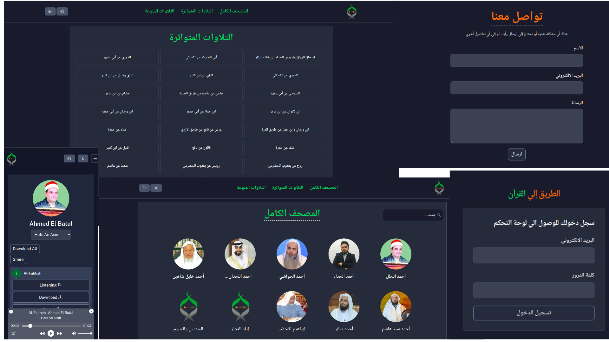
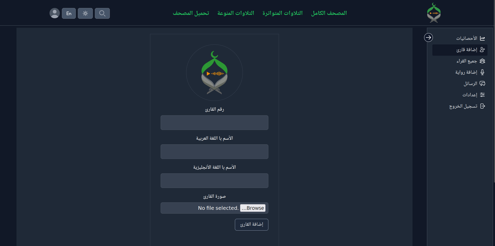
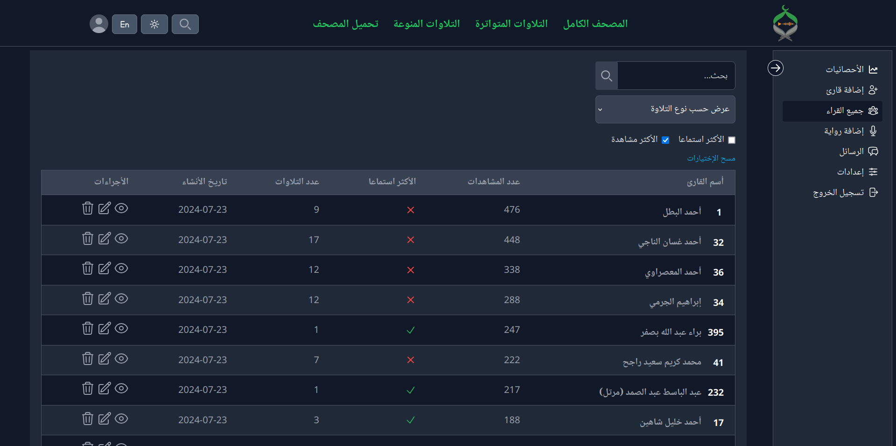
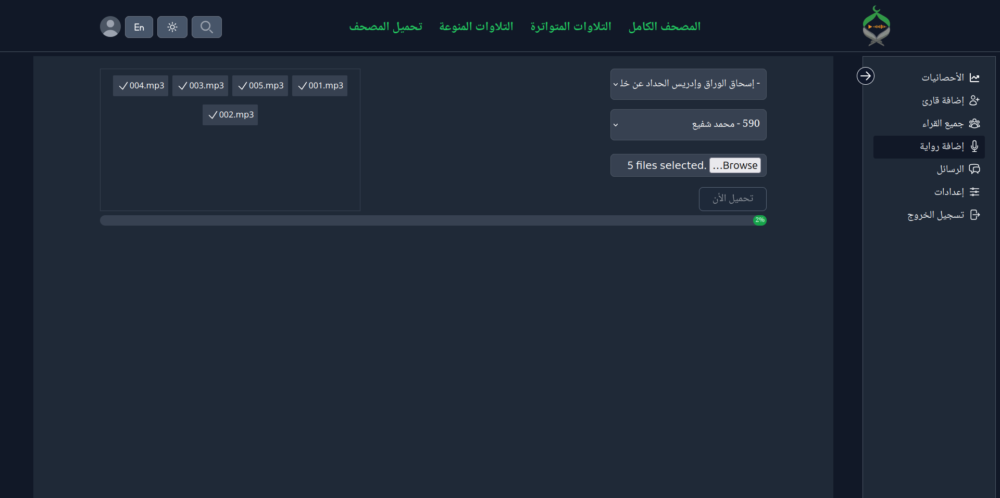
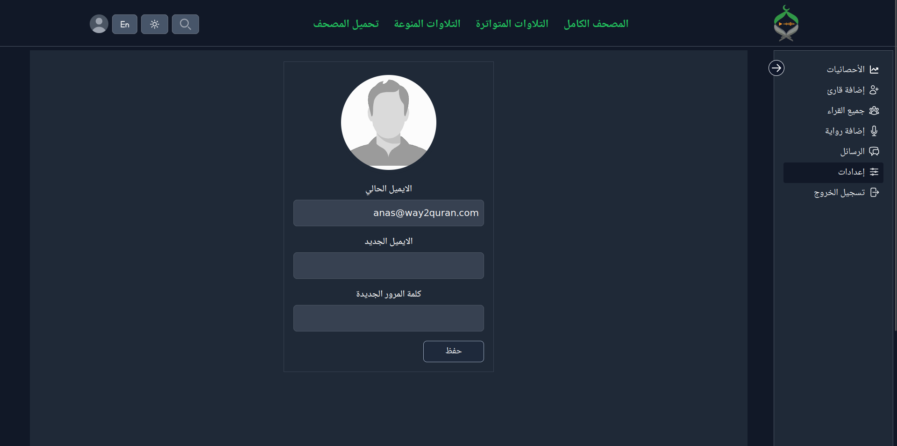
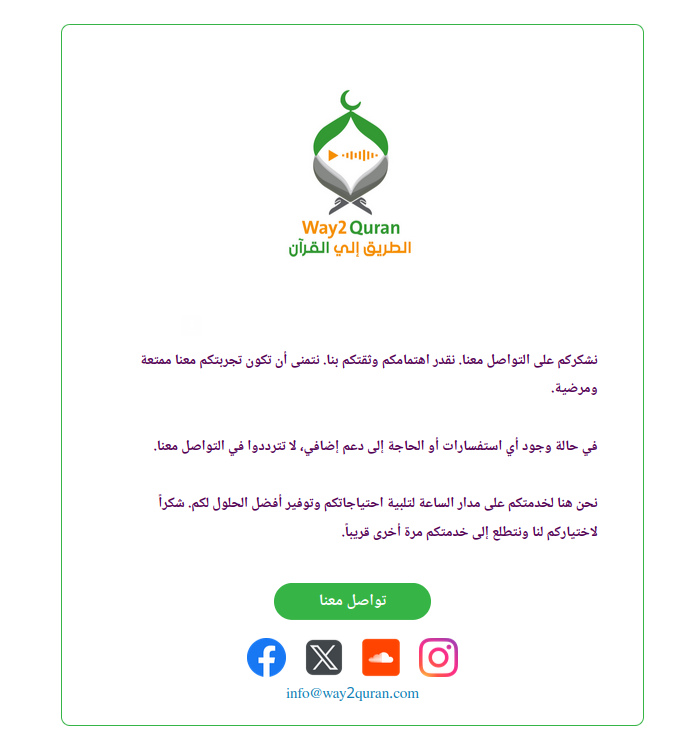

# Way2quran.com 🕌📖

**Way2Quran** is your gateway to the world of Quranic recitations! 🎧🌍

## Features 🌟

- 🎙️ Listen and download Quran recitations from popular reciters worldwide
- 🌐 Support for both **Arabic** and **English** languages
- 🌓 Light and dark mode themes
- 💾 Cache reciter's content using Redis for faster access
- 🚀 Static Site Generation (SSG) in Next.js for building reciter pages at build time
- ⚡ Lazy loading and code splitting for faster initial load times
- ☁️ Integrate with Google Cloud Storage for secure file and photo uploads

- 📱 Responsive design for seamless experience across all devices
- ♿ Accessibility implementation following WCAG guidelines
- 🔍 Dynamic SEO and metadata for both Arabic and English languages
- 🔒 JWT authentication and data encryption
- 📧 SMTP service using Nodemailer for client communication

## Technologies Used 🛠️

- **Frontend**: **Next.js** for a fast and interactive user experience
- **Backend**: **Node.js** and **Express** for robust server-side functionalities
- **Database**: **MongoDB** for efficient data storage and retrieval
- **Caching**: **Redis** for improved performance
- **Cloud Storage**: **Google Cloud Storage** for secure and scalable storage solutions
- **Email Service**: **Nodemailer** for SMTP integration

## Installation 🚀

To run the project locally, follow these steps:

1. Install [Node.js](https://nodejs.org/en)
2. Clone this repository
3. Install dependencies:
   ```bash
   npm run setup
   ```
4. Set up your MongoDB database, Redis, and Google Cloud Storage
5. Configure environment variables in `.env.local` file:

   ```bash
   NODE_ENV=---
   PORT=---
   REDIS_PORT=6379

   MONGO_DB_URL=---

   JWT_SECRET=---
   JWT_EXPIRES_IN=---
   JWT_COOKIE_EXPIRES_IN=---

   SMTP_HOST=
   SMTP_PORT=
   SMTP_EMAIL=
   SMTP_PASSWORD=

   CLIENT_URL=---
   BUCKET_NAME=---
   ```

6. Add `cloud-configuration.json` file in the root directory for Google Cloud services access
7. Run the application:
   ```bash
   npm run dev
   ```

## Screenshots 📸



## Dashboard







## Email Template 📧


