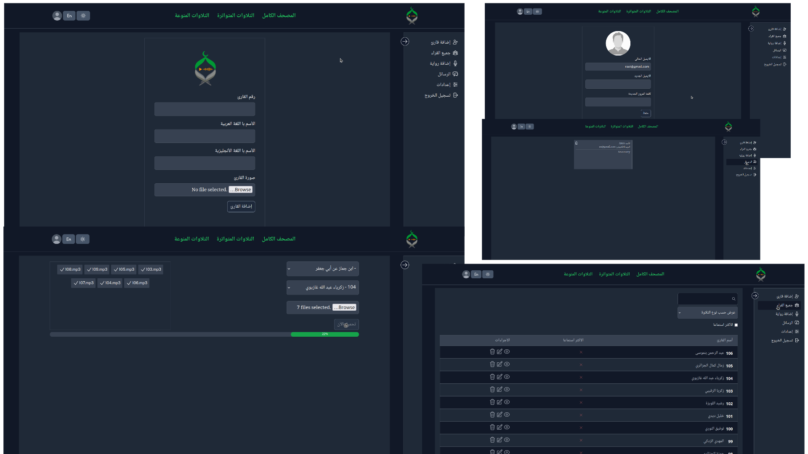

# Way2quran.com

- **Way2Quran** provides listening and downloading quran recitations of most popular reciters around the world

- **Way2Quran** Support for both **_Arabic_** and **_English_** languages, as well as **_light_** and **_dark_** mode themes.

## Technologies Used

- **Frontend**: **_Next.js_** for a fast and interactive user experience.
- **Backend:** **_Node.js_** and **_Express_** for robust server-side functionalities.
- **Database**: **_MongoDB_** for efficient data storage and retrieval.
- **Data Storage**: **_Google Cloud Storage_** for secure and scalable storage solutions.

## Installation

To run the project locally, follow these steps:

- First, you need to **[install node.js](https://nodejs.org/en)**
- Clone this repository.
- Install dependencies using `npm run setup`.
- Set up your MongoDB database and Google Cloud Storage.
- Configure environment variables in `.env` file.

  ```bash
       CLIENT_URL=next.js url
       NODE_ENV = ---
       MONGO_DB_URL= ---
       PORT=---
       JWT_SECRET=---
       JWT_EXPIRES_IN=---
       JWT_COOKIE_EXPIRES_IN=---

       BUCKET_NAME=---
  ```

- Add `cloud-configuration.json` file in the root directory to enable access to Google Cloud services.

- Run the application using `npm run dev`

## Screenshot



